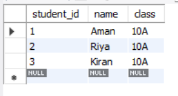
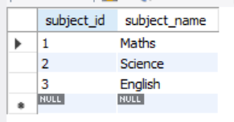
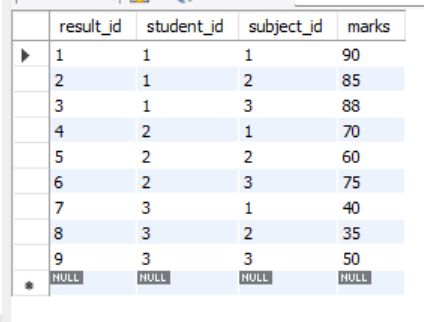
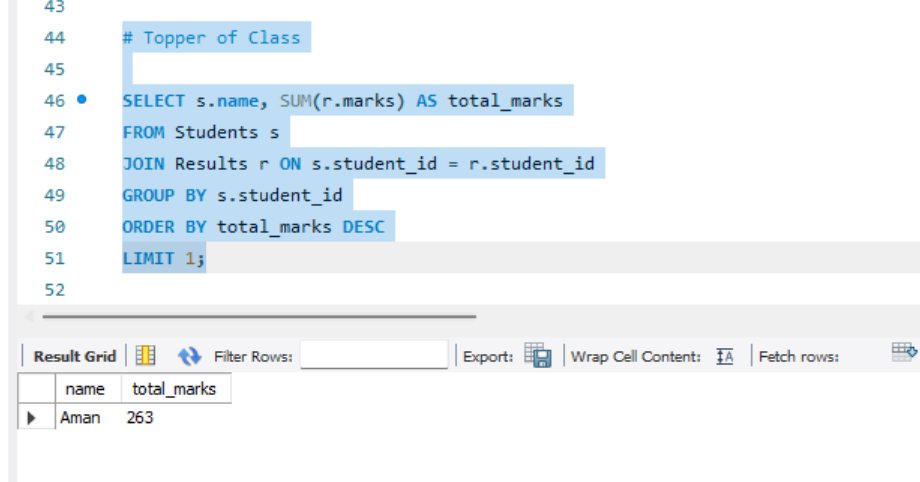
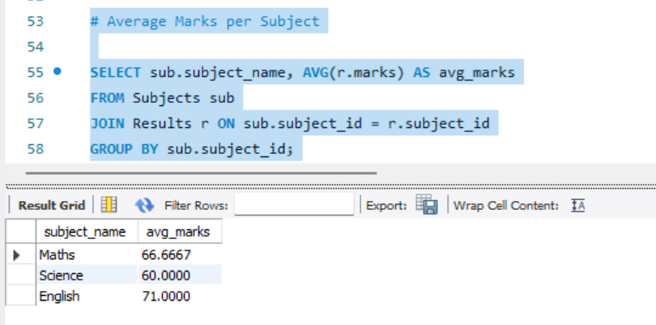
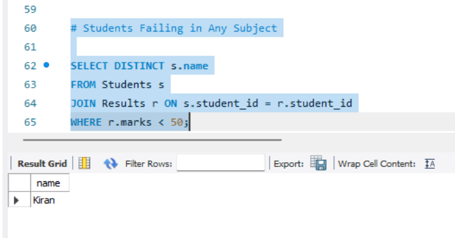

# Student Result Analysis System

## Problem Statement

Develop a SQL-based system to analyze student academic performance and generate insights such as toppers, subject-wise averages, and failing students.

## Features

* Store student details
* Store subject details
* Record student marks
* Identify class topper
* Calculate average marks per subject
* Find students failing in any subject

---

## Technologies Used

* MySQL
* SQL (DDL, DML, Queries)
* Joins & Aggregate Functions

---

##  Database Structure

### Students Table

* `student_id` → Student ID
* `name` → Student Name
* `class` → Class

### Subjects Table

* `subject_id` → Subject ID
* `subject_name` → Subject Name

### Results Table

* `result_id` → Unique ID
* `student_id` → Reference to Students
* `subject_id` → Reference to Subjects
* `marks` → Marks obtained

---

## How to Run

1. Open MySQL Workbench
2. Run the SQL script step by step:

   * Create database
   * Create tables
   * Insert data
   * Execute queries

---
## Output Screenshots

 
<b>Students Table</b>

  

 
<b>Subjects Table</b>

  

 
<b>Results Table</b>

  

 
<b>Topper of Class</b>

  

 
<b>Average Marks per Subject</b>

  

 
<b>Students Failing in Any Subject</b>

